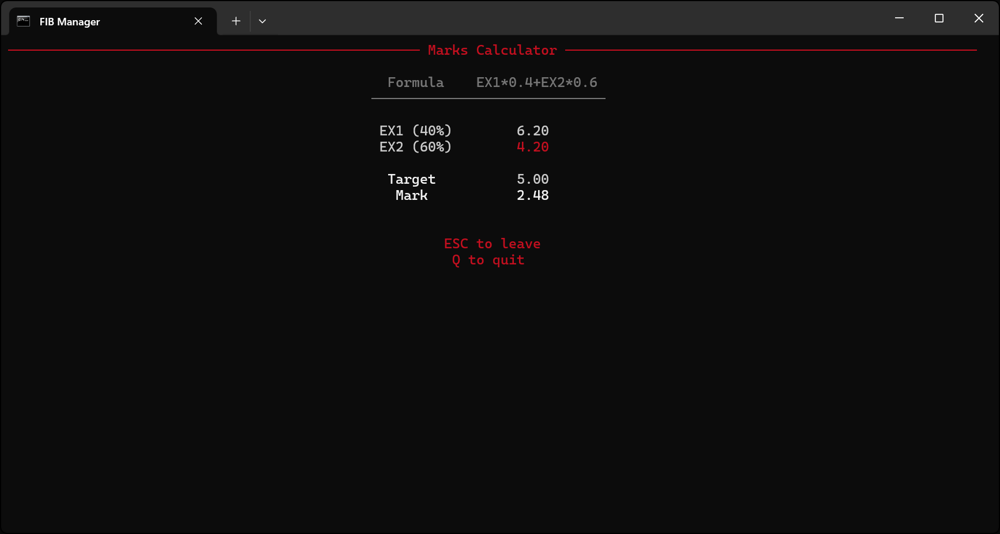

# FIB Manager

A powerful command-line and interactive console application for FIB (Facultat d'Informàtica de Barcelona - UPC) students to search, generate, and manage class schedules and academic grade calculations using the official UPC public API.

## 🚀 What is FIB Manager?

FIB Manager is designed to simplify academic life for computer science students at UPC by providing:

1. **Smart Schedule Generation**: Automatically finds all valid combinations of classes that fit your constraints
2. **Interactive Schedule Viewer**: Beautiful visual interface to browse and compare different schedule options
3. **Grade Calculator (Beta)**: Advanced formula-based calculator for academic grade planning and analysis
4. **Subject Browser**: Comprehensive database of all available subjects per quadrimester

## ✨ Key Features

### Schedule Management
- **Intelligent Schedule Generation**: Fetches real-time class data and generates all valid group/subgroup combinations
- **Advanced Filtering**: Filter by time ranges, preferred languages (Catalan, Spanish, English), blacklisted groups, and maximum class days
- **Dead Hours Optimization**: Automatically calculates and minimizes gaps between classes
- **Interactive Grid View**: Visual schedule representation with color-coded subjects
- **Direct Browser Integration**: One-click access to official UPC schedule URLs
- **Multi-language Support**: Full support for Catalan, Spanish, and English interfaces

### Grade Calculations (Beta)
- **Formula-based Calculator**: Solve complex academic grade formulas with missing variables
- **Interactive Grade Planner**: Plan required grades for upcoming exams to achieve target marks
- **Mathematical Expression Support**: Handles complex formulas with operators, comparisons, and mathematical functions
- **Safe Evaluation Engine**: Secure formula processing with built-in validation

### Data Management
- **Real-time API Integration**: Direct connection to UPC's official academic API
- **Subject Database**: Complete catalog of all FIB subjects with multi-language names
- **Quadrimester Support**: Works with any academic quadrimester (e.g., 2024Q1, 2024Q2)
- **Export Capabilities**: JSON output for integration with other tools

## 📋 Requirements

- **Python 3.8 or higher**
- **Operating System**: Windows, Linux, or macOS
- **Internet Connection**: Required for accessing UPC API
- **Dependencies**:
  - `requests` (≥2.0.0) - HTTP requests to UPC API
  - `rich` (≥12.0.0) - Beautiful terminal output and tables
  - `questionary` (≥1.10.0) - Interactive command-line prompts
  - `pyfiglet` (≥0.8.post1) - ASCII art for splash screens
  - Additional dependencies listed in `requirements.txt`

## 🛠️ Installation

### Option 1: Pre-built Executables (Easiest)

Download ready-to-use executable files from the [Releases Page](https://github.com/zvictorium/fib-manager/releases):

- **App Version**: Download `FIB Manager.exe` (Interactive console application with keyboard navigation)
- **CLI Version**: Download `fib-manager.exe` (Command-line interface)

Simply download and run - no Python installation required!

```bash
# Example for App Version (Interactive Console)
"./FIB Manager.exe"

# Example for CLI Version
./fib-manager.exe --help
```

### Option 2: Quick Setup (Recommended for Developers)

```bat
# Clone or download the project
cd fib-manager

# Run the automated setup script
.\scripts\setup.bat
```

### Option 3: Manual Installation

#### Windows

```bat
# Create virtual environment
python -m venv env

# Activate virtual environment
env\Scripts\activate

# Install dependencies
pip install -r requirements.txt

# Install the package in development mode
pip install -e .
```

#### Linux / macOS

```bash
# Create virtual environment
python3 -m venv env

# Activate virtual environment
source env/bin/activate

# Install dependencies
pip install -r requirements.txt

# Install the package in development mode
pip install -e .
```

### Verify Installation

```bash
fib-manager --help
```

If the installation was successful, you should see the help menu with all available commands.

## 📸 Screenshots

### Interactive App Main Menu

*The main interactive interface with intuitive navigation options*

### Schedule Browser

*Visual schedule grid showing classes with color-coded subjects and time slots*

### Subject Explorer

*Browse all available subjects with multi-language support*

### Grade Calculator (Beta)

*Interactive grade planning with formula-based calculations*

## 🎯 Usage

FIB Manager offers three main modes of operation: **Interactive App**, **CLI Commands**, and **Grade Calculator (Beta)**.

### 🖥️ Interactive Mode (Recommended for Beginners)

Launch the full interactive application with a guided interface:

```bash
fib-manager app
```

**Interactive Features:**
- **Subject Browser**: Browse all available subjects for any quadrimester
- **Guided Setup**: Step-by-step configuration of schedule preferences
- **Visual Schedule Viewer**: Navigate through compatible schedules with keyboard controls
- **Instant Browser Opening**: Press SPACE to open current schedule in your web browser
- **Grade Calculator (Beta)**: Interactive grade planning and formula solving

### 💻 Command Line Interface

For advanced users and automation:

```bash
fib-manager <command> [OPTIONS]
```

**Available Commands:**

| Command | Description | Example |
|---------|-------------|---------|
| `app` | Start interactive application | `fib-manager app` |
| `schedules` | Generate schedule combinations | `fib-manager schedules -s IES XC --start 9` |
| `subjects` | List available subjects | `fib-manager subjects -q 2024Q1 -l en` |
| `marks` | Calculate grades and solve formulas (Beta) | `fib-manager marks --formula "EX1*0.6+EX2*0.4" --target 7.0` |

### 📊 Grade Calculator (Beta)

Solve complex academic grade formulas:

```bash
# Calculate required exam grades
fib-manager marks --formula "EX1 * 0.4 + EX2 * 0.6" --target 7.0 --values EX1=6.5

# Interactive grade planning
fib-manager marks --view
```

## ⚙️ Command Reference

### Global Options

| Option | Description | Example |
|--------|-------------|---------|
| `-q, --quadrimester` | Quadrimester code (auto-detected if not specified) | `-q 2024Q1` |
| `-h, --help` | Show help message | `--help` |

### 📅 Schedules Command

Generate and filter valid schedule combinations.

```bash
fib-manager schedules -s SUBJECT1 SUBJECT2 [OPTIONS]
```

#### Options

| Option | Type | Default | Description |
|--------|------|---------|-------------|
| `-s, --subjects` | **Required** | - | Subject codes (e.g., `IES`, `XC`, `PROP`) |
| `--start` | Integer | `8` | Starting hour (inclusive, 24h format) |
| `--end` | Integer | `20` | Ending hour (exclusive, 24h format) |
| `-l, --languages` | List | All | Preferred languages (`en`, `es`, `ca`) |
| `--freedom` | Flag | `False` | Allow different subgroup tens than group |
| `--days` | Integer | `5` | Maximum number of days with classes |
| `--blacklist` | List | - | Blacklisted subject-group pairs (`IES-101`) |
| `-v, --view` | Flag | `False` | Launch interactive schedule viewer |
| `--sort` | String | `groups` | Sort mode: `groups` or `dead-hours` |

### 📚 Subjects Command

List and browse available subjects.

```bash
fib-manager subjects [OPTIONS]
```

#### Options

| Option | Type | Default | Description |
|--------|------|---------|-------------|
| `-q, --quadrimester` | String | Current | Quadrimester code |
| `-l, --language` | String | `en` | Display language (`en`, `es`, `ca`) |
| `-v, --view` | Flag | `False` | Interactive table viewer |

### 📈 Marks Command (Beta)

Advanced grade calculation and formula solving.

```bash
fib-manager marks --formula "FORMULA" --target TARGET [OPTIONS]
```

#### Options

| Option | Type | Description |
|--------|------|-------------|
| `--formula` | **Required** | Mathematical formula (e.g., `"EX1*0.4+EX2*0.6"`) |
| `--target` | **Required** | Target grade to achieve |
| `--values` | List | Known variable values (`VAR=value`) |
| `-v, --view` | Flag | Interactive results viewer |

#### Formula Syntax

- **Variables**: Use any name (e.g., `EX1`, `LAB`, `FINAL`)
- **Operators**: `+`, `-`, `*`, `/`, `^` (exponentiation)
- **Functions**: `min()`, `max()`, `round()`, `abs()`
- **Comparisons**: `>`, `<`, `>=`, `<=`, `==`, `!=`
- **Parentheses**: For grouping expressions

## 💡 Examples

### 🎯 Basic Schedule Search

Find schedules for specific subjects:

```bash
# Simple schedule search
fib-manager schedules -s IES XC

# With time constraints (9 AM to 6 PM)
fib-manager schedules -s IES XC --start 9 --end 18

# Prefer English and Spanish classes, max 4 days
fib-manager schedules -s IES XC PROP -l en es --days 4
```

### 🔧 Advanced Schedule Filtering

```bash
# Allow flexible subgroup assignment and blacklist specific groups
fib-manager schedules -s IES XC --freedom --blacklist IES-101 XC-205

# Interactive viewer with dead hours optimization
fib-manager schedules -s IES XC PROP --sort dead-hours -v

# Complete example with all options
fib-manager schedules \
  --quadrimester 2024Q2 \
  -s IES XC PROP \
  --start 9 --end 18 \
  -l en es \
  --days 4 \
  --freedom \
  --blacklist IES-101 \
  --sort dead-hours \
  -v
```

### 📊 Grade Calculations

```bash
# Calculate needed final exam grade
fib-manager marks \
  --formula "LAB*0.3 + MIDTERM*0.3 + FINAL*0.4" \
  --target 7.0 \
  --values LAB=8.5 MIDTERM=6.0

# Complex formula with conditions
fib-manager marks \
  --formula "max(0.4*EX1 + 0.6*EX2, min(EX1, EX2))" \
  --target 5.0 \
  --values EX1=4.0

# Interactive grade planning
fib-manager marks --view
```

### 📚 Subject Information

```bash
# List all subjects for current quadrimester
fib-manager subjects

# Specific quadrimester in Catalan
fib-manager subjects -q 2024Q1 -l ca

# Interactive subject browser
fib-manager subjects -v

# English subject names for 2024Q2
fib-manager subjects -q 2024Q2 -l en
```

### 🖥️ Interactive Mode Examples

Launch the full interactive application:

```bash
# Start interactive mode
fib-manager app
```

**In Interactive Mode:**
1. **Schedule Planning**: Select subjects → Set preferences → Browse results
2. **Grade Calculator (Beta)**: Enter formula → Input known grades → Get required grades
3. **Subject Explorer**: Browse by quadrimester → Filter by language → Export data

## ⌨️ Interactive Controls

### Schedule Viewer Navigation

When viewing schedules in the interactive interface:

| Key | Action |
|-----|--------|
| `←` / `→` | Navigate between different valid schedules |
| `↑` / `↓` | Scroll through schedule details |
| `SPACE` | Open current schedule URL in default web browser |
| `TAB` | Toggle between grid view and detailed group list |
| `S` | Change sorting mode (groups ↔ dead hours) |
| `ESC` | Return to previous menu |
| `Q` | Quit application |

### General Interface Controls

| Key | Action |
|-----|--------|
| `ENTER` | Confirm selection |
| `ESC` | Go back/Cancel |
| `Q` | Quit application |
| `↑` / `↓` | Navigate menu options |
| `SPACE` | Select/Toggle option |

### Grade Calculator Controls (Beta)

| Key | Action |
|-----|--------|
| `ESC` | Return to main menu |
| `Q` | Quit application |

## 🏗️ Project Structure

```
fib-manager/
├── src/app/                    # Main application package
│   ├── commands/               # CLI command implementations
│   │   ├── __init__.py         # Commands package initialization
│   │   ├── command_line.py     # Main CLI entry point and argument parsing
│   │   ├── search.py           # Schedule search and generation utilities
│   │   ├── subjects.py         # Subject listing and browsing logic
│   │   └── marks.py            # Grade calculator and formula evaluation
│   ├── core/                   # Core business logic
│   │   ├── __init__.py         # Core package initialization
│   │   ├── constants.py        # Application constants and configuration
│   │   ├── parser.py           # Data parsing and processing utilities
│   │   ├── schedule_generator.py # Schedule generation orchestration
│   │   ├── utils.py            # Common utilities and helper functions
│   │   └── validator.py        # Schedule validation and combination logic
│   ├── api/                    # UPC API integration
│   │   ├── __init__.py         # API package initialization and exports
│   │   └── api.py              # API client implementation and data fetching
│   ├── ui/                     # User interface components
│   │   ├── __init__.py         # UI package initialization
│   │   ├── interactive.py      # Interactive mode implementation and flows
│   │   └── ui.py               # UI rendering utilities and display functions
│   ├── __init__.py             # Main app package initialization
│   ├── __main__.py             # Application entry point for compiled executables
│   └── __version__.py          # Version information and metadata
├── scripts/                    # Automation and build scripts
│   ├── setup.bat               # Windows development environment setup
│   ├── start.bat               # Windows application launcher
│   └── compile.bat             # PyInstaller build script for executables
├── docs/                       # Documentation and assets
│   └── screenshots/            # Application screenshots for README
│       ├── grade-calculator.png
│       ├── main-menu.png
│       ├── schedule-viewer.png
│       └── subject-browser.png
├── requirements.txt           # Python dependencies and versions
├── setup.py                   # Package configuration and installation
├── LICENSE                    # Creative Commons license text
├── README.md                  # This comprehensive documentation
└── .gitignore                 # Git ignore rules for development files
```

## 🛠️ Development & Contributing

### Setting Up Development Environment

1. **Fork and Clone**
   ```bash
   git clone https://github.com/yourusername/fib-manager.git
   cd fib-manager
   ```

2. **Setup Development Environment**
   ```bash
   # Windows
   .\scripts\setup.bat
   
   # Linux/macOS
   python3 -m venv env
   source env/bin/activate
   pip install -r requirements.txt
   pip install -e .
   ```

3. **Run Tests**
   ```bash
   # Test CLI functionality
   fib-manager --help
   fib-manager subjects
   ```

### Code Style & Standards

- **Python Version**: 3.8+
- **Code Style**: Follow PEP 8
- **Documentation**: Include docstrings for all functions
- **Type Hints**: Use type annotations where appropriate
- **Error Handling**: Implement proper exception handling
- **Logging**: Use the logging module for debug information

### Architecture Guidelines

- **Separation of Concerns**: CLI, Core Logic, API, and UI are separate modules
- **Single Responsibility**: Each module has a clear, single purpose
- **Error Handling**: Graceful degradation and informative error messages
- **API Integration**: Respectful API usage with proper rate limiting
- **User Experience**: Intuitive interfaces with helpful feedback

### Contributing Process

1. **Create Feature Branch**
   ```bash
   git checkout -b feature/your-feature-name
   ```

2. **Make Changes**
   - Follow existing code patterns
   - Add tests for new functionality
   - Update documentation as needed

3. **Test Thoroughly**
   - Test CLI commands
   - Test interactive mode
   - Verify API integration
   - Check error handling

4. **Submit Pull Request**
   - Clear description of changes
   - Reference any related issues
   - Include testing steps

### Bug Reports & Feature Requests

When reporting bugs or requesting features:

- **Bug Reports**: Include error messages, steps to reproduce, and environment details
- **Feature Requests**: Describe the use case and expected behavior
- **API Issues**: Note any changes in UPC API responses

## 🔧 Troubleshooting

### Common Issues

**Installation Problems**
```bash
# Clear pip cache and reinstall
pip cache purge
pip install --no-cache-dir -r requirements.txt
```

**API Connection Issues**
```bash
# Test API connectivity
fib-manager subjects
```

**Interactive Mode Issues**
- Ensure terminal supports ANSI colors
- On Windows, use Windows Terminal or PowerShell
- Avoid using basic Command Prompt

**Schedule Generation Problems**
```bash
# Test with a simple query first
fib-manager schedules -s IES XC
```

## 📊 Performance & Limitations

### Performance Characteristics

- **API Calls**: Minimized through intelligent caching
- **Schedule Generation**: Optimized for up to 10 subjects simultaneously
- **Memory Usage**: Efficient data structures for large datasets
- **Response Time**: Typically < 5 seconds for complex queries

### Current Limitations

- **Subject Limit**: Recommended maximum of 10 subjects per query
- **API Dependency**: Requires internet connection for real-time data
- **Language Support**: Limited to Catalan, Spanish, and English
- **Platform**: Interactive mode optimized for desktop terminals

## 📄 License

This project is licensed under the **Creative Commons Attribution-NonCommercial 4.0 International License (CC BY-NC 4.0)**.

### What this means:
- ✅ **You can**: Use, modify, and share this software for non-commercial purposes
- ✅ **You can**: Create derivative works and adaptations
- ✅ **You must**: Provide attribution to the original creators
- ❌ **You cannot**: Use this software for commercial purposes without permission

For commercial use, please contact the maintainers.

**Full License Text**: See [LICENSE](LICENSE) file or visit [Creative Commons License](https://creativecommons.org/licenses/by-nc/4.0/)

## 🙋 Support

### Getting Help

- **Documentation**: This README covers most use cases
- **Issues**: Report bugs or request features through GitHub issues
- **Discussions**: Join community discussions for questions and tips

### Contact & Links

- **🐙 Project Repository**: [https://github.com/zvictorium/fib-manager](https://github.com/zvictorium/fib-manager)
- **📋 Issue Tracker**: [https://github.com/zvictorium/fib-manager/issues](https://github.com/zvictorium/fib-manager/issues)
- **📚 Documentation**: [https://github.com/zvictorium/fib-manager](https://github.com/zvictorium/fib-manager)
- **📦 Releases**: [https://github.com/zvictorium/fib-manager/releases](https://github.com/zvictorium/fib-manager/releases)
- **☕ Buy me a coffee**: [https://buymeacoffee.com/victorium](https://buymeacoffee.com/victorium)

---

**Made with ❤️ for FIB students at UPC**

*If this tool helps you with your studies, consider [buying me a coffee](https://buymeacoffee.com/victorium) to support continued development!* ☕
